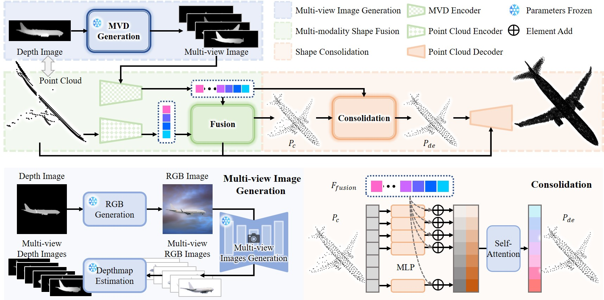
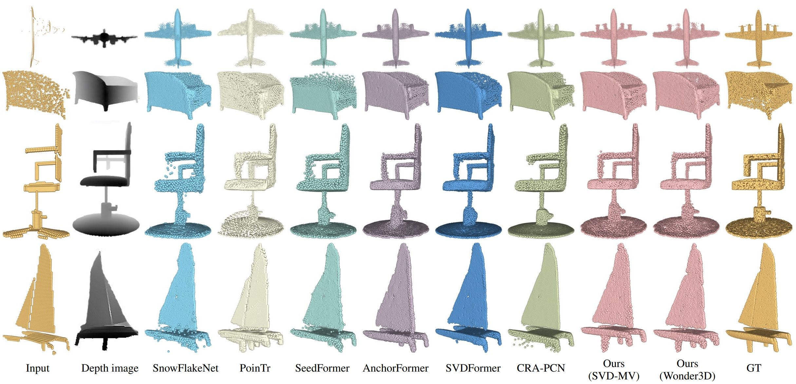

<div align='center'>
<h1>PCDreamer: Point Cloud Completion Through Multi-view Diffusion Priors </h1>
</div>
This repository contains the PyTorch implementation of the paper:

**(CVPR 2025) PCDreamer: Point Cloud Completion Through Multi-view Diffusion Priors**

[[**arXiv**]](https://arxiv.org/abs/2411.19036) [[**Project page**]](https://gsw-d.github.io/PCDreamer/)

<!-- <br> -->
[Guangshun Wei](https://gsw-d.github.io/gswei.github.io/), Yuan Feng, Long Ma, Chen Wang, Yuanfeng Zhou, [Changjian Li](https://enigma-li.github.io/).
<!-- <br> -->



## Abstract

> This paper presents PCDreamer, a novel method for point cloud completion. Traditional methods typically extract features from partial point clouds to predict missing regions, 
> but the large solution space often leads to unsatisfactory results. More recent approaches have started to use images as extra guidance, effectively improving performance,
> but obtaining paired data of images and partial point clouds is challenging in practice. To overcome these limitations, we harness the relatively view-consistent multi-view diffusion priors 
> within large models, to generate novel views of the desired shape. The resulting image set encodes both global and local shape cues, which is especially beneficial for shape completion. 
> To fully exploit the priors, we have designed a shape fusion module for producing an initial complete shape from multi-modality input (i.e., images and point clouds), 
> and a follow-up shape consolidation module to obtain the final complete shape by discarding unreliable points introduced by the inconsistency from diffusion priors. 
> Extensive experimental results demonstrate our superior performance, especially in recovering fine details.



## 🔥News
- **[2025-03-xx]** Code and pre-trained weights released!

## Pretrained Models
We provide pretrained PCDreamer models on PCN and ShapeNet-55 [here](), download and put it into the ``./checkpoints`` 
folder. 


## Get Started

### Requirements
Our models have been tested on the configuration below:
- python == 3.9.17
- PyTorch == 2.0.1
- CUDA == 11.8
- numpy == 1.24.4
- open3d ==  0.17.0

Install requirements and pytorch extensions for chamfer distance, PointNet++.
```
pip install -r requirements.txt

cd pointnet2_ops_lib
python setup.py install

cd ../metrics/CD/chamfer3D/
python setup.py install

cd ../../EMD/
python setup.py install

cd ../../extensions/chamfer_dist
python setup.py install

cd ../..
```

Tips: If you have a configured virtual environment for [PoinTr](https://github.com/yuxumin/PoinTr) or [SVDFormer](https://github.com/czvvd/SVDFormer_PointSea), you can reuse it instead of installing a new one.

### Inference
We have provided examples from PCN and ShapeNet55 in the folder ``./demo_pcn`` and ``./demo_55``, respectively.
Each model includes multi-view depth images available in both PFM format (normalized) and the corresponding PNG format for presentation.

Note: To demonstrate PCDreamer's ability to handle general partial point clouds, the provided partial point clouds from ShapeNet55 
are generated by selecting a fixed viewpoint and removing 75% of the nearest points from the complete shapes (similar to the conventional hard setting).
```
__C.CONST.WEIGHTS = "path to your checkpoint"

# The results should be generated in the folder './infer_res/'
python main_(pcn_w3d/pcn_svd/55_w3d/55_svd).py --inference --infer_root './demo_(pcn/55)/pts'
```

### Dataset
1. Download the raw [PCN](https://gateway.infinitescript.com/s/ShapeNetCompletion) and [ShapeNet55/34](https://github.com/yuxumin/PoinTr) datasets.
2. Follow the instructions provided [here](https://github.com/wentaoyuan/pcn/tree/master/render) to generate partial point clouds from a fixed viewpoint.
3. Multi-view images and corresponding depth images can be generated by any latest large generation models and depth estimation network.
4. For training and evaluation, specify the data path in config_*.py (pcn/55) and implement your custom DataLoader 
in ``./utils/data_loaders.py`` to align with your directory structure.
```
# Specify the checkpoint path in config_*.py
# PCN
__C.DATASETS.SHAPENET.PARTIAL_POINTS_PATH        = '/path/to/PCN_partial/%s/partial/%s/%s/%02d.pcd'
__C.DATASETS.SHAPENET.COMPLETE_POINTS_PATH       = '/path/to/PCN/%s/complete/%s/%s.pcd'
__C.DATASETS.SHAPENET.VIEW_PATH                  = '/path/to/PCN_imgs/%s/%s/'

# ShapeNet-55
__C.DATASETS.SHAPENET55.COMPLETE_POINTS_PATH     = '/path/to/shapenet_pc/%s'
__C.DATASETS.SHAPENET.VIEW_PATH                  = '/path/to/ShapeNet_imgs/%s/%s/'

# Switch to ShapeNet-34 Seen/Unseen
__C.DATASETS.SHAPENET55.CATEGORY_FILE_PATH       = '/path/to/datasets/ShapeNet34(ShapeNet-Unseen21)'
```

### Evaluation
```
# Specify the checkpoint path in config_*.py
__C.CONST.WEIGHTS = "path to your checkpoint"

python main_*.py --test (pcn_w3d/pcn_svd/55_w3d/55_svd)
```

### Training
```
python main_*.py (pcn_w3d/pcn_svd/55_w3d/55_svd) 
```
## Acknowledgement
The repository is based on [PoinTr](https://github.com/yuxumin/PoinTr) and
[SVDFormer](https://github.com/czvvd/SVDFormer_PointSea), some of the code is borrowed from:
- [PytorchPointNet++](https://github.com/erikwijmans/Pointnet2_PyTorch)
- [Density-aware Chamfer Distance](https://github.com/wutong16/Density_aware_Chamfer_Distance)
- [CRA-PCN](https://github.com/EasyRy/CRA-PCN)

Besides, PCDreamer is heavily based on methods for depth estimation, such as [DepthAnything](https://github.com/LiheYoung/Depth-Anything), [DepthAnything V2](https://github.com/DepthAnything/Depth-Anything-V2),
and foundation models, such as [ControlNet](https://github.com/lllyasviel/ControlNet), [Wonder3D](https://github.com/xxlong0/Wonder3D) and [Stable Video 3D (SV3D)](https://github.com/Stability-AI/generative-models). 
In the future, if a multi-view generation model does not limited to a fixed initial viewpoint, the potential restriction can be naturally resolved. 

We thank the authors for their excellent works！

## Citation
```
@article{wei2024pcdreamerpointcloudcompletion,
      title={PCDreamer: Point Cloud Completion Through Multi-view Diffusion Priors},
      author={Guangshun Wei, Yuan Feng, Long Ma, Chen Wang, Yuanfeng Zhou, Changjian Li},
      year={2025},
      journal={CVPR},
}
```


